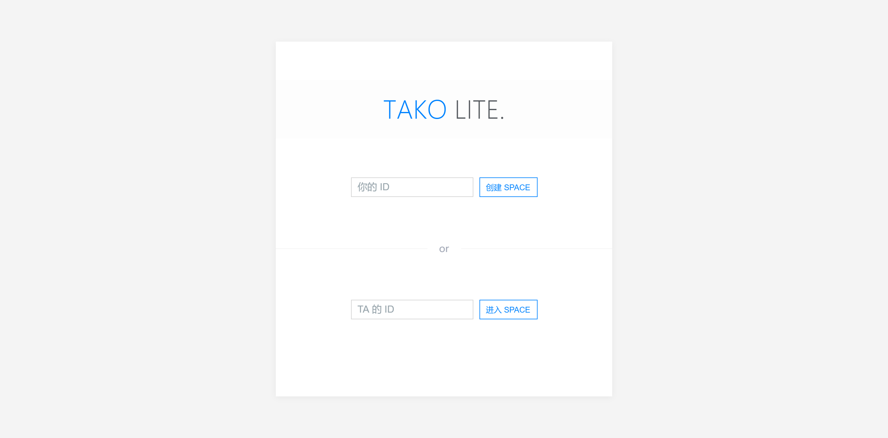
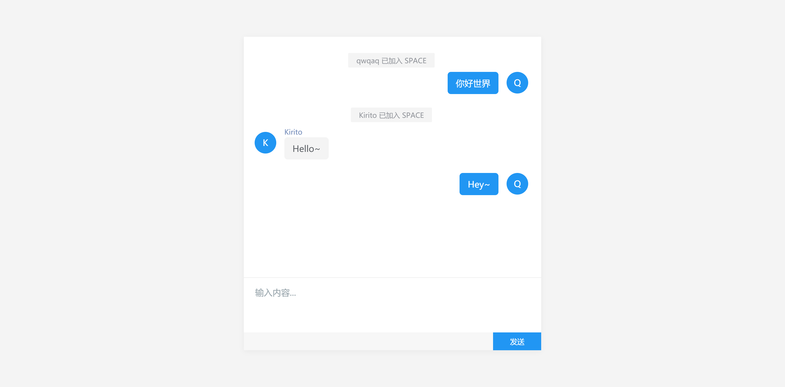

# tako-lite

轻量级实时通讯 Web App

A light Instant Messaging Web Application.

## 食用

1. Apache 或 nginx 配置 `/public` 为网站根目录
2. 安装 node 并安装依赖 `yarn install`，执行 `yarn start` 运行服务器端
3. 配置 `/public/index.html` 中 `window.takoLiteConfig.server` 为服务器端请求地址
